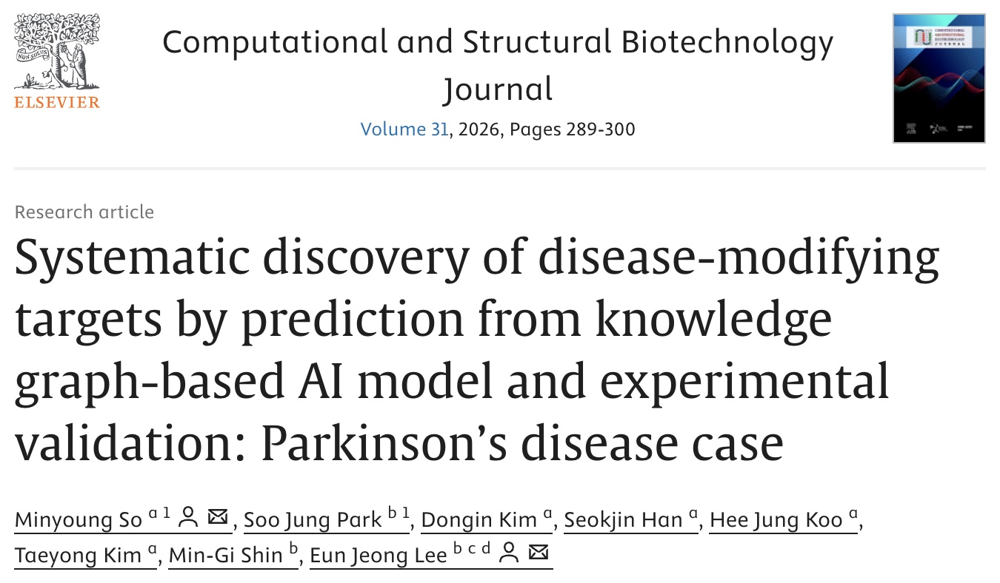

::::::::: grid
::::: {.g-col-12 .g-col-md-6}
:::: {.card .h-100}
{.card-img-top alt="gene"}

::: card-body
### Health Data Science Report

**Mid-term Project** \| *University of Michigan*

RNA-seq analysis of the GSE292178 dataset investigating the effects of
the PDE5 inhibitor (Viagra) on mitochondrial disease.

`#RNAseqAnalysis` `#MitochondrialDisease` `#R` `#DataScience`

  [📄 View Report](MidTermProject_So_Final_Rev.html) \| **Mar 2026**
:::
::::
:::::

::::: {.g-col-12 .g-col-md-6}
:::: {.card .h-100}
::: card-body
### AI Drug Discovery Paper

**Journal: CSBJ** \| *So et al.*

AI application of a Biomedical Knowledge-Graph Database for Parkinson's
Disease.\
*(First & Corresponding Author)*

`#AIDrugDiscovery` `#KnowledgeGraph` `#AI` `#ResearchPaper`
`#ParkinsonDisease`

  [🔗 Read Paper](https://doi.org/10.1016/j.csbj.2025.12.035) \|
**Jan 2026**
:::
{.card-img-bottom alt="title" style="border:2px solid #c0392b; border-radius:2px;"}
::::
:::::
:::::::::
